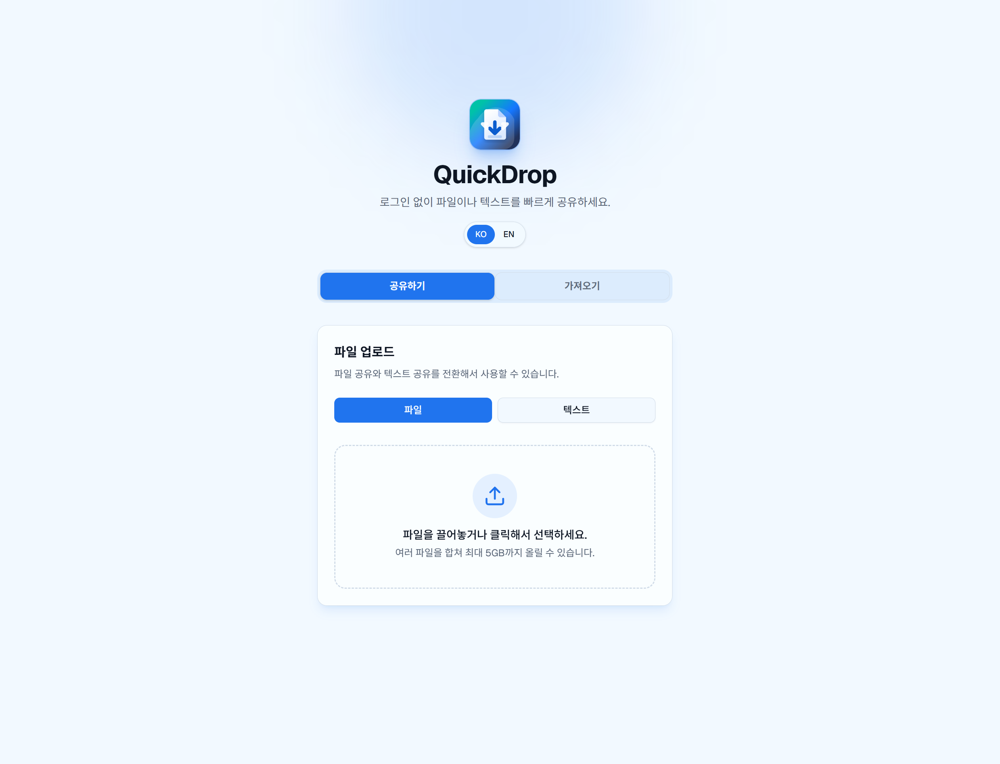
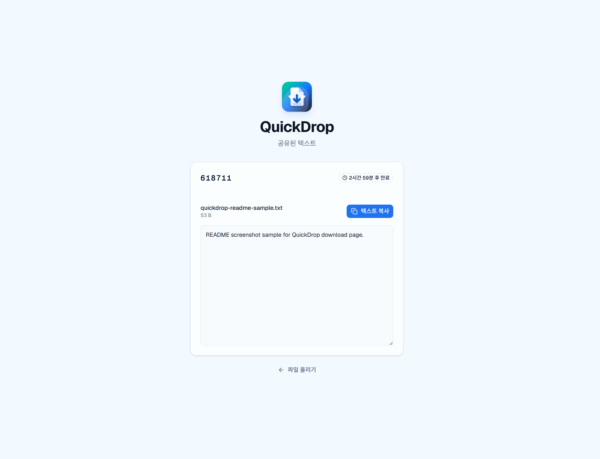

# QuickDrop

QuickDrop은 로그인 없이 파일이나 텍스트를 빠르게 공유하는 임시 공유 서비스입니다. 업로드하면 6자리 공유 코드, 공유 링크, QR 코드가 생성되고, 받는 사람은 코드나 링크로 접속해 파일을 내려받거나 공유된 텍스트를 복사할 수 있습니다.

## 화면 캡처

### 홈 화면



### 업로드 화면


### 다운로드 화면



## 주요 기능

- 파일 업로드: 여러 파일을 합쳐 최대 5GB까지 업로드
- 텍스트 공유: 짧은 메모부터 큰 텍스트까지 임시 공유
- 코드 기반 수신: 6자리 공유 코드로 다운로드 페이지 접근
- 공유 링크와 QR 코드: 모바일과 데스크톱 간 전달을 쉽게 처리
- 만료 시간 설정: 업로드 후 지정 시간 뒤 세션과 파일 자동 삭제
- 업로드 이력: 현재 브라우저에서 최근 공유 항목 확인
- 다국어 UI: 한국어와 영어 지원
- 운영 로그: 프로덕션 환경에서 Discord Webhook으로 업로드/다운로드 로그 전송 가능

## 기술 스택

- Framework: Next.js 16 App Router
- Language: TypeScript, React 19
- Styling: Tailwind CSS 4, Radix UI 기반 UI 컴포넌트, lucide-react 아이콘
- Data fetching: TanStack Query
- Database: SQLite, Prisma 7, better-sqlite3 adapter
- File handling: Busboy multipart streaming, 로컬 파일시스템 저장
- Download packaging: archiver ZIP 생성
- i18n: next-intl
- Scheduler: node-cron으로 만료 세션 정리
- Analytics/Log: Google Analytics, Discord Webhook 선택 연동

## 로컬 실행

```bash
npm install
npm run dev
```

개발 서버는 `http://localhost:3001`에서 실행됩니다.

프로덕션 빌드는 아래 명령으로 확인합니다.

```bash
npm run build
npm run start
```

## 환경 변수

```env
DATABASE_URL="file:./dev.db"
NEXT_PUBLIC_BASE_URL="https://your-domain.example"
UPLOAD_DIR="./uploads"
MAX_FILE_SIZE="5368709120"
MAX_FILE_SIZE_LABEL="5GB"
MAX_TEXT_BYTES="52428800"
MAX_TEXT_BYTES_LABEL="50 MB"
SESSION_EXPIRY_HOURS="24"
NEXT_PUBLIC_GA_ID="G-XXXXXXXXXX"
DISCORD_WEBHOOK_URL="https://discord.com/api/webhooks/..."
```

- `DATABASE_URL`: SQLite 데이터베이스 경로
- `NEXT_PUBLIC_BASE_URL`: 공유 링크와 QR 코드에 사용할 외부 접속 URL
- `UPLOAD_DIR`: 업로드 파일 저장 경로
- `MAX_FILE_SIZE`: 파일 업로드 총량 제한
- `MAX_TEXT_BYTES`: 텍스트 공유 크기 제한
- `SESSION_EXPIRY_HOURS`: 기본 세션 만료 시간
- `NEXT_PUBLIC_GA_ID`: Google Analytics Measurement ID
- `DISCORD_WEBHOOK_URL`: 프로덕션 로그 전송용 Discord Webhook URL

## 배포 방식

현재 배포는 Windows 미니 PC 위의 WSL 환경에서 Next.js 프로덕션 서버를 실행하고, Windows/WSL 앞단의 Nginx가 외부 요청을 받아 Next.js 서버로 프록시하는 방식입니다.

배포 흐름은 다음과 같습니다.

```bash
npm ci
npx prisma migrate deploy
npm run build
npm run start
```

Next.js 앱은 기본적으로 WSL 내부 `3001` 포트에서 실행합니다. Nginx는 외부 도메인의 HTTP/HTTPS 요청을 받아 `http://127.0.0.1:3001`로 전달합니다.

Nginx 예시 설정입니다.

```nginx
server {
    server_name your-domain.example;

    client_max_body_size 6g;

    location / {
        proxy_pass http://127.0.0.1:3001;
        proxy_http_version 1.1;
        proxy_set_header Host $host;
        proxy_set_header X-Real-IP $remote_addr;
        proxy_set_header X-Forwarded-For $proxy_add_x_forwarded_for;
        proxy_set_header X-Forwarded-Proto $scheme;
        proxy_set_header Upgrade $http_upgrade;
        proxy_set_header Connection "upgrade";
    }
}
```

운영 시에는 SQLite DB 파일과 `UPLOAD_DIR` 경로가 유지되도록 WSL 내부의 영구 디렉터리에 두고, 앱 프로세스는 `systemd`, `pm2`, 작업 스케줄러 등으로 재시작되도록 관리합니다.
